# we sell fish
[2025] Web app mock-up created in order to emmulate a wholesale company website, whos main product includes a variety of fish. A simple yet effective design, this site demonstrates understanding of web development principles, design aesthetics, and React coding essentials.

## About the Project
First project created after learning the basics of React development. I decided on a company website because of its intuitive and straightforward design. Through the course of this project, I was able to become familiar with both React tools and Tailwind for css. While I agree that the page itself is faily simple and unimagnative, I find it difficult to frown upon this one as it was my first React project. I remember how accomplished I felt after finishing coding this one, and it allowed me to gain enough confidence to keep going and create even crazier/more creative ideas.

### Nav + Footer
Nav is straightforward, contains the website title on the left corner and the nav components on the right. When each nav component is hovered over a quick animation plays that makes the component appear to be underlined/selected.

### Home Page
Home page is made up of four main sections. The hero, company cards, recent images, and the location map. The hero contains an automatic slideshow that moves between three distinct images. The company cards contain basic company information such as mission, purpose, promise, email, and phone number. The recent images display any new fish products that the company has recently put up for sale. The map section contains the location of the company as well as a google map embed.

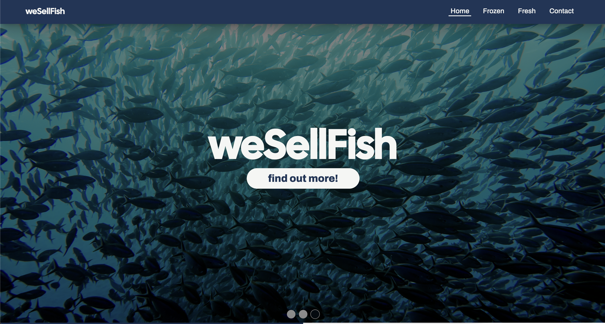
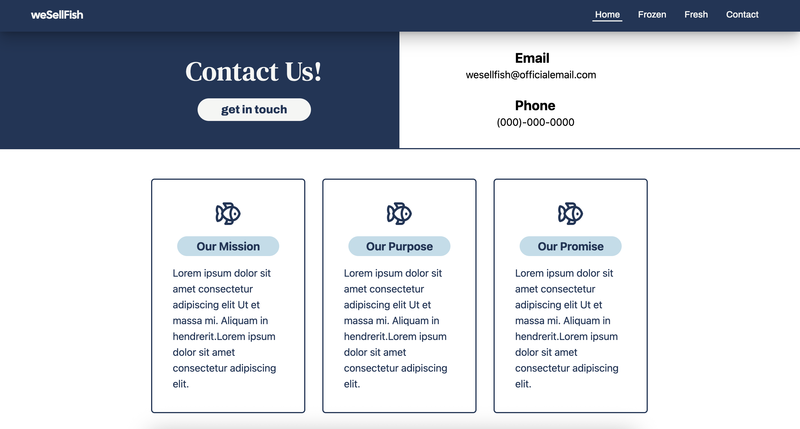
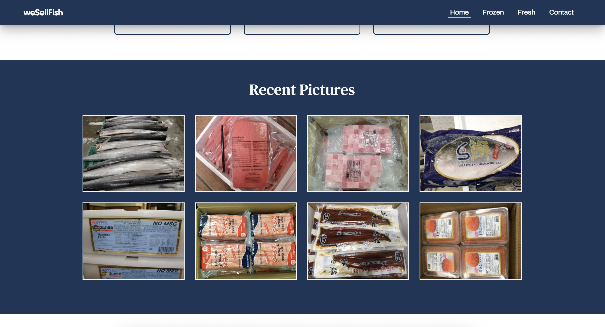
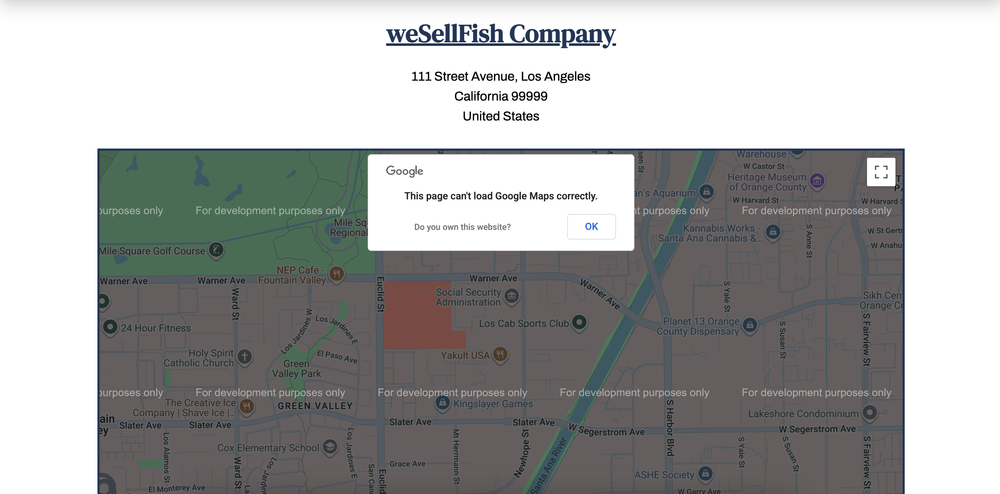

### Frozen / Fresh Page
Both of these pages are similar. They contain the appropriate fish products for that page followed by a contact button that would lead the user to the 'Contact' page.

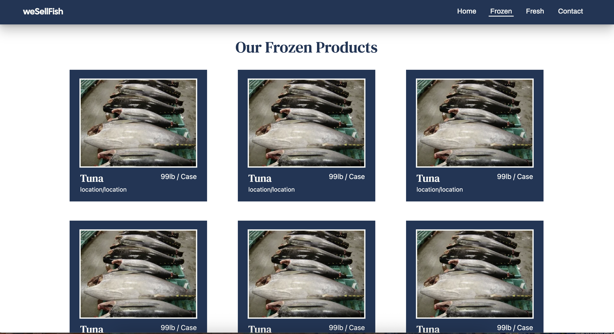
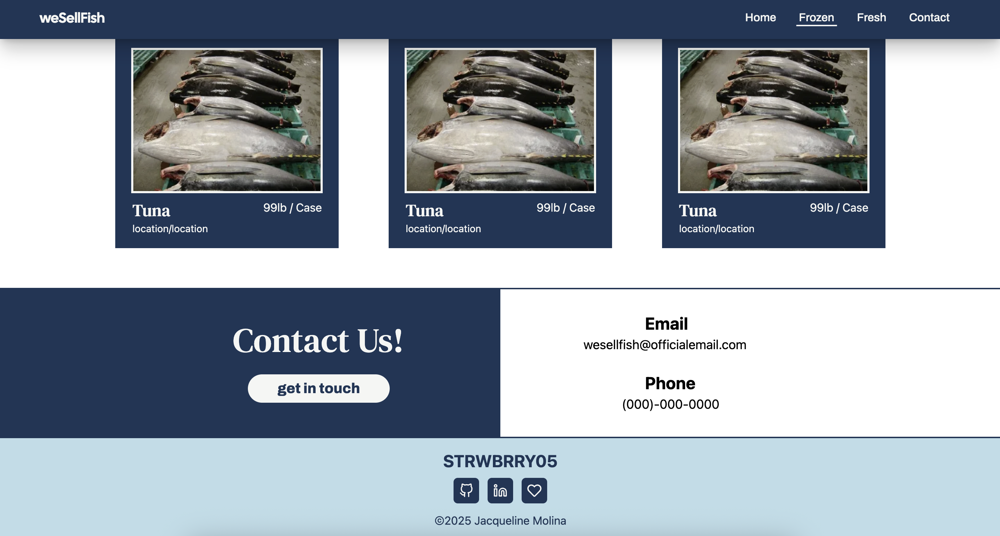

### Contact
Contact page contains a form to submit any orders or send any messages to the company employees. Following the contact page, the map section is placed again in order to ensure the user/customer knows exactly which company this is.

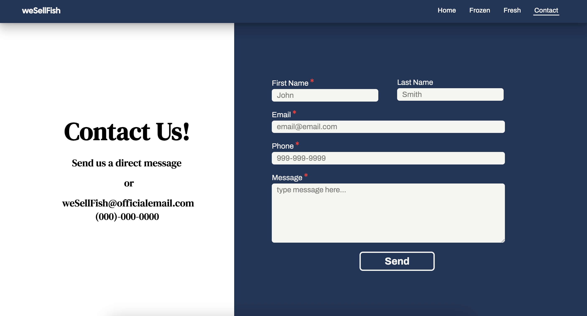
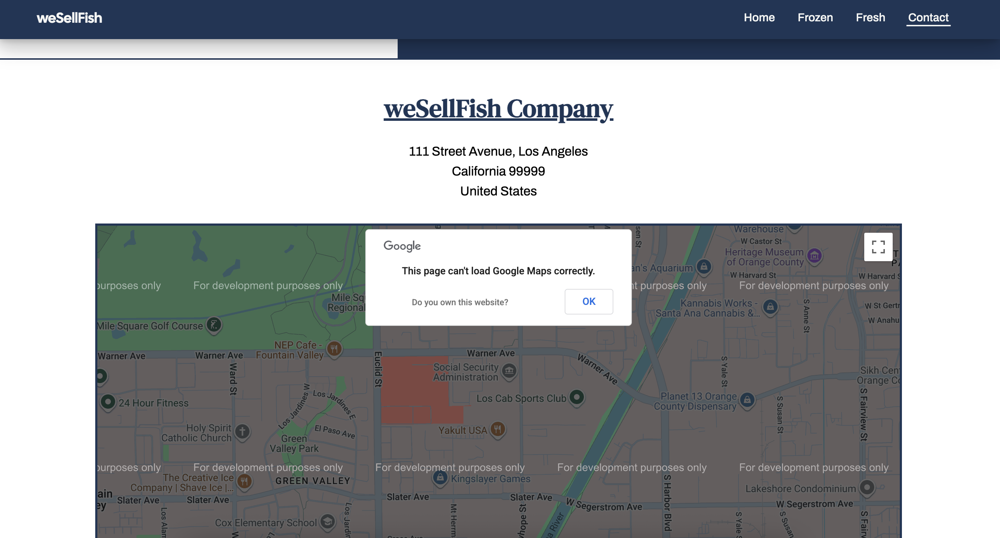

## Responsive View
Developed using mobile first development, website is responsive in that it offers both mobile to desktop views. The key difference between mobile and desktop view is that the Navigation menu is now a hamburger menu rather than a horizontal one. Other components on the page have been altered slightly in order to make them fit each new dimensions.

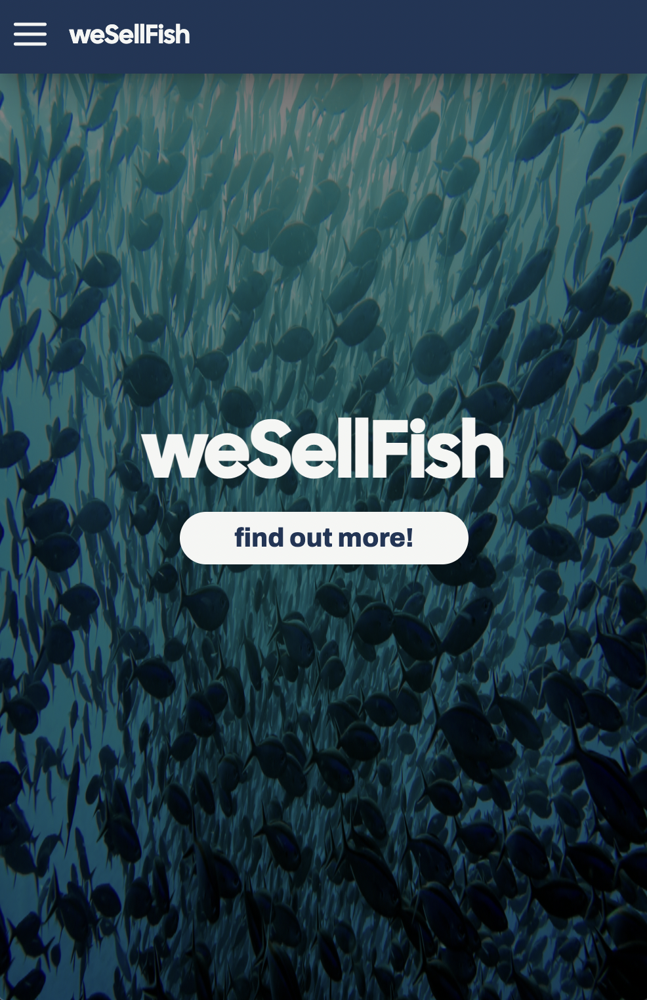
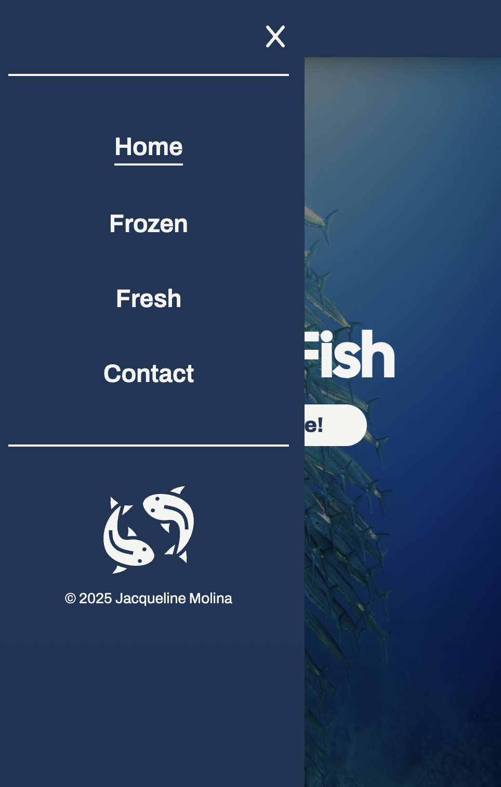
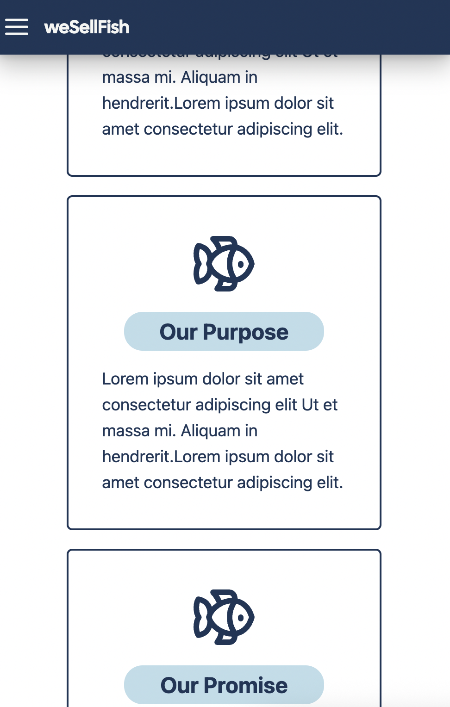
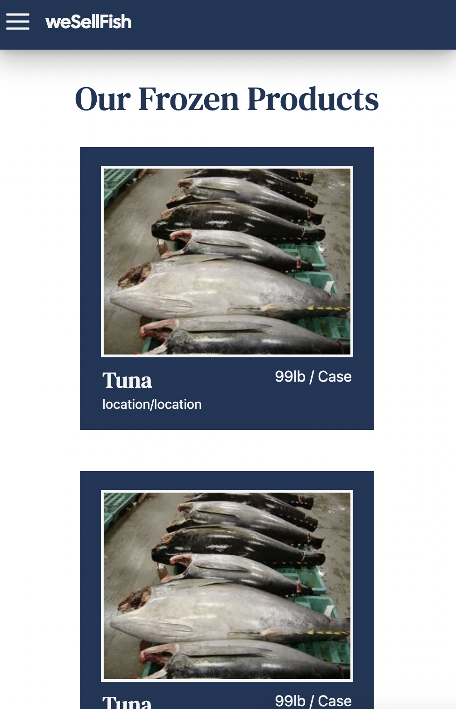
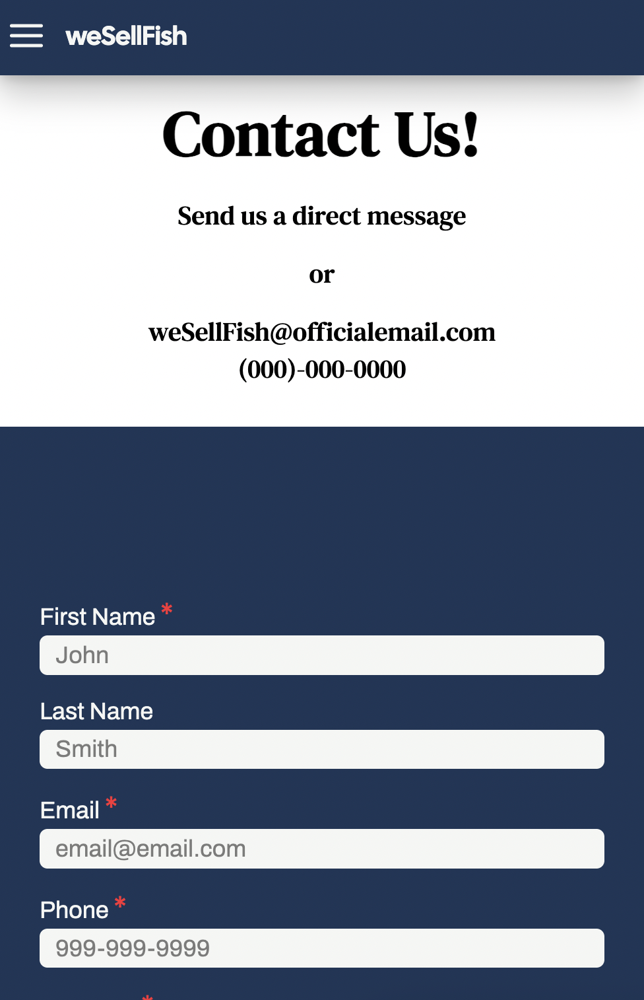

## Potential Improvements

## Built Using
- HTML
- CSS
- VSCode
- React + Vite
- NodeJS

## Contact
Any comments, questions, or concerns?\
Contact Jacqueline Molina: molina.jq19@gmail.com
